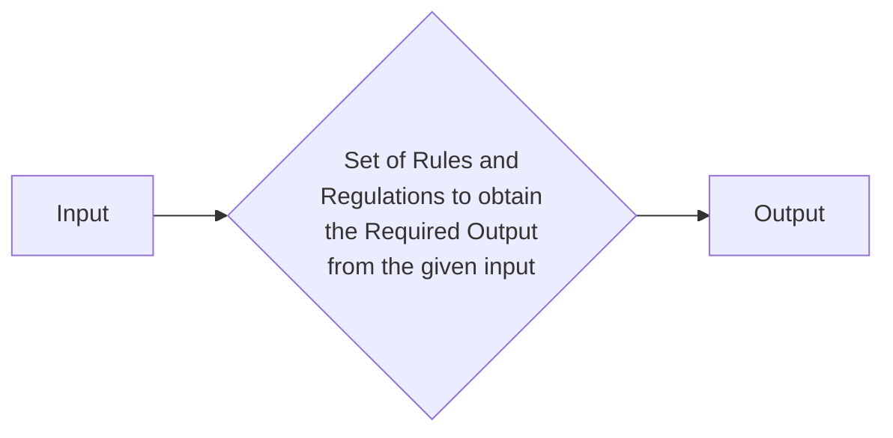

## Fundamentals of Algorithm Analysis
**Definition of Algorithm:**
```
The word Algorithm means 
” A set of finite rules or instructions to be followed in calculations or other problem-solving operations ”
Or
” A procedure for solving a mathematical problem in a finite number of steps that frequently involves recursive operations”.
```


    
### **Uses of Algorithm**

**1. Computer Science:** it is the foundation of computer programming cause it takes input and gives output within the set of rules also it is base foundation of AI and ML in Computer Programming.

**2. Mathematics:** Algo is also used in mathematics doing calculation and finding optimum solution for a linear problem also in finding the shortest path in a graph

**3. Operational Research:** it is also used in operational research to optimize things and find the data and optimal things so that we can improve Logistics, Transportation etc.

**4. Artificial Intelligence:** it is the base foundation of Artificial Intelligence and Machine learning it helps in making Intelligence system which helps in Facial Recognition, Decision Making and Language Processing

**5. Data Science:** it is used to Handle big data chains and Process, Analyze and Extract Specific datas from them in Many Industries like Finance, Marketing etc.


>Algorithms help to do a task in programming to get the expected output.
>
>The Algorithm designed are language-independent, i.e. they are just plain instructions that can be implemented in any language, and yet the output will be the same, as expected.

### Why Algo is Used or Necessary?
+ it is necessary to solve problems effectively and efficiently
+ They help to automate process and make them more Reliable, Faster and Easy to use
+ They help Computer do the process or things that are impossible to do by Humans Manually
+ They are used in Different Fields like AI, ML, Data Science, Computation and etc.


 ```mermaid
mindmap
  root((mindmap))
    Language Independant
    Effective
    Unambiguous
    Finite
    Well Defined Input
    Well Defined Output
    Feasible

```

### Advantages of Algorithm
- Algos are easy to understand
- It gives step wise solution to any problem
- It is easy for a programmer to Code it because it break down problems into smaller steps

### Disadvantages of Algorithm
- Time Consuming to write algorithms
- Complex logic are very hard to understand
- Loops and Branching are hard to understand in Algorithm
  
## Space and Time complexity of an algorithm
The Complexity in the Algorithm is determined by the Time and Space it uses, That means the Total time it took to execute the program and also the Storage Required to the program to successfully execute it.

So by this,
We can Divide the complexity into two parts

- **Space Factor:** Total Amount of Storage is observed by counting the maximum memory space required by the algorithm
- **Time Factor:** Total time is observed by counting the number of key operations

### Space Complexity: 
